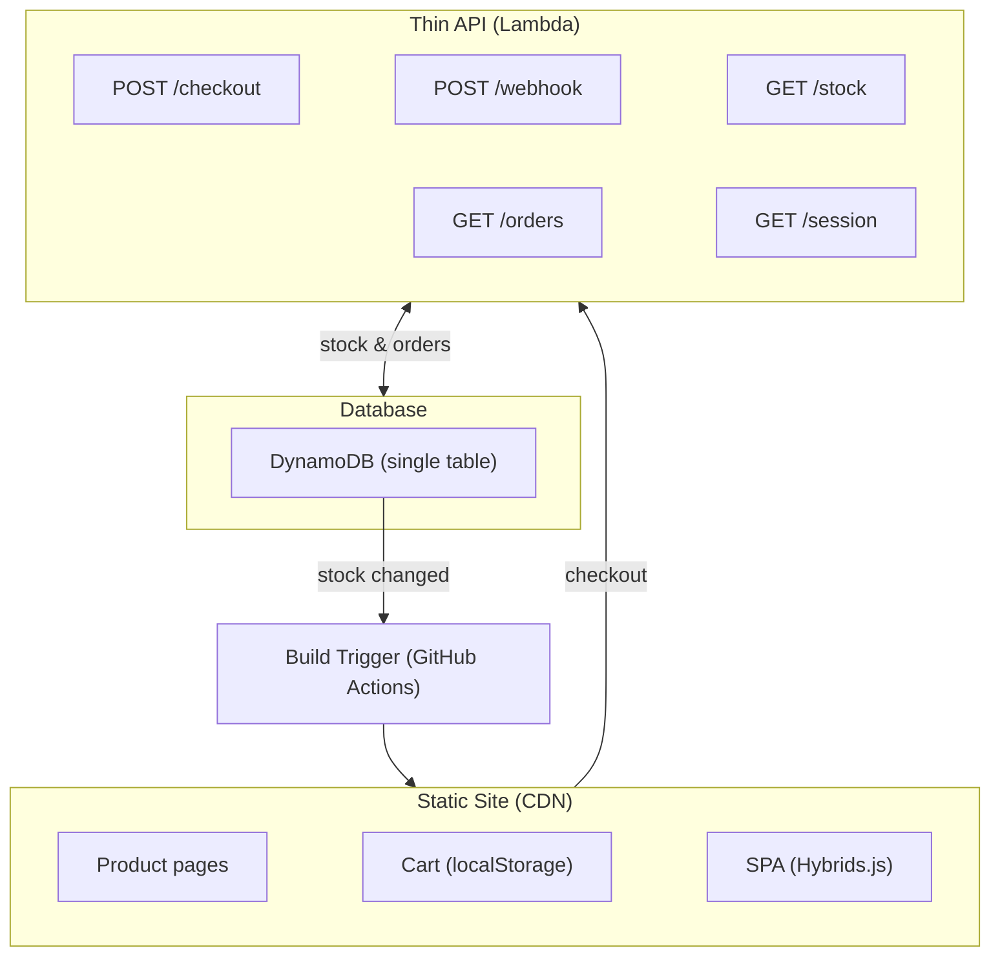

<p align="center">
  <a href="https://staticart.org">
    
  </a>
</p>

<h1 align="center">StatiCart</h1>
<p align="center">
  Free and open source, cheaply hosted, Stripe-powered,<br/>
  full-featured, limited-scope e-commerce platform.
</p>
<p align="center">
  <a href="https://staticart.org">staticart.org</a> ·
  <a href="https://www.npmjs.com/package/@techninja/staticart">npm</a> ·
  <a href="https://github.com/techninja/staticart">GitHub</a>
</p>

---

Built with the [Clearstack](https://github.com/techninja/clearstack) no-build web component specification. Ships as an npm package that scaffolds complete stores via Clearstack's platform stacking system.

## Architecture

<div align="center">



</div>

## Quick Start (New Store)

```bash
mkdir my-store && cd my-store
npm init -y
npm install @techninja/staticart
npm install -D @techninja/clearstack
npx clearstack init -y --static   # Detects StatiCart, scaffolds store
npm install
npm run dev
```

Edit `staticart.config.json` to set your store name, then replace `src/data/products.json` with your catalog.

## Quick Start (Development)

```bash
npm install
cd api && npm install && cd ..
npm run dev       # Start dev server (port from .env.local)
npm test          # Run tests (18 node + 31 browser)
npm run spec      # Spec compliance checker (11/11)
```

## Configuration

All store settings live in `staticart.config.json`:

```json
{
  "store": {
    "name": "My Store",
    "logo": "/assets/logo.svg",
    "locale": "en-US",
    "currency": "USD"
  },
  "shipping": { "type": "flat", "amount": 499 },
  "tax": { "automatic": false },
  "productFields": {
    "isbn": { "type": "string", "label": "ISBN" },
    "grade": { "type": "string", "label": "Condition" }
  }
}
```

- `store.name` — displayed in the header (text fallback when no logo)
- `store.logo` — optional path to logo image
- `shipping.type` — `"flat"`, `"tiered"`, or `"custom"` (see docs)
- `productFields` — custom metadata fields rendered on product detail pages

## Environment

Copy `.env` defaults. Override in `.env.local` (gitignored):

```bash
STRIPE_SECRET_KEY=sk_test_...    # From Stripe dashboard
STRIPE_WEBHOOK_SECRET=whsec_...  # From `stripe listen` CLI
```

## Platform Stacking

StatiCart is a Clearstack platform. Child projects get:

- Vendored components, store models, utils, and styles in `src/vendor/staticart/`
- Config-driven branding, shipping, and product fields
- Override any component via import map specificity
- Override styles via CSS custom properties in `tokens.css`
- Override translations via `locales/overrides.json`

See `docs/app-spec/SCAFFOLD.md` for the full override architecture.

### Component Overrides

```bash
node scripts/override.js molecules/product-card
```

This copies the vendor component to `src/components/` and patches the import map. Edit freely — your override is project-owned and never overwritten.

### Vendor Sync (Development)

When developing StatiCart itself, sync source to the vendor directory before committing:

```bash
node scripts/sync-vendor.js
```

## i18n

Default language is English. To translate:

1. Set locale in `staticart.config.json`: `{ "store": { "locale": "es" } }`
2. Package translations live in `src/locales/<lang>.json` (UI chrome only)
3. Project overrides in `src/locales/overrides.json` (English) and `src/locales/overrides.<lang>.json`
4. Add custom keys for your own components in the override files

Cascade: package defaults → locale file → project overrides → project locale overrides.

The package translates **framework UI** (buttons, labels, status text). Store-specific
terms — category names, variant labels, product descriptions — are **project data**.
Define display names for your categories via `category.<slug>` keys in override files.
Variant labels come from `products.json` and are the store owner's responsibility.

## Shipping

Three shipping models:

- **Flat rate** — single fixed amount (`"type": "flat"`)
- **Tiered** — rate tiers by cart subtotal with product classes and regional pricing (`"type": "tiered"`)
- **Custom** — project-provided module at `api/lib/shipping-custom.js` (`"type": "custom"`)

## Deploy

**Static site:** `src/` → CDN (S3+CloudFront or Cloudflare Pages)

**API:** `api/` → AWS Lambda via SAM:

```bash
cd api
sam build && sam deploy --guided
```

**Build pipeline:** GitHub Actions rebuilds on stock changes:

```bash
node scripts/build-products.js   # DynamoDB → dist/data/products.json
```

## Specification

See `docs/` for the full specification this project follows.

## License

MIT
